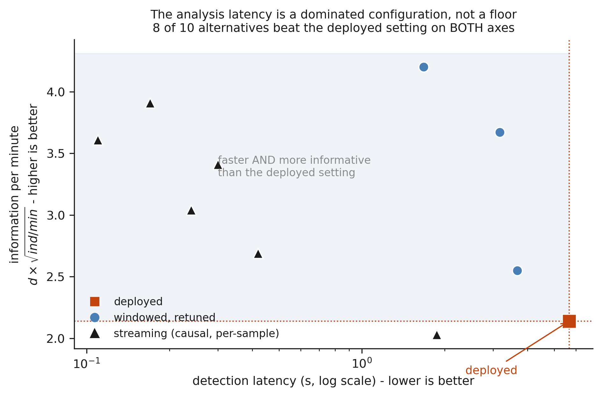
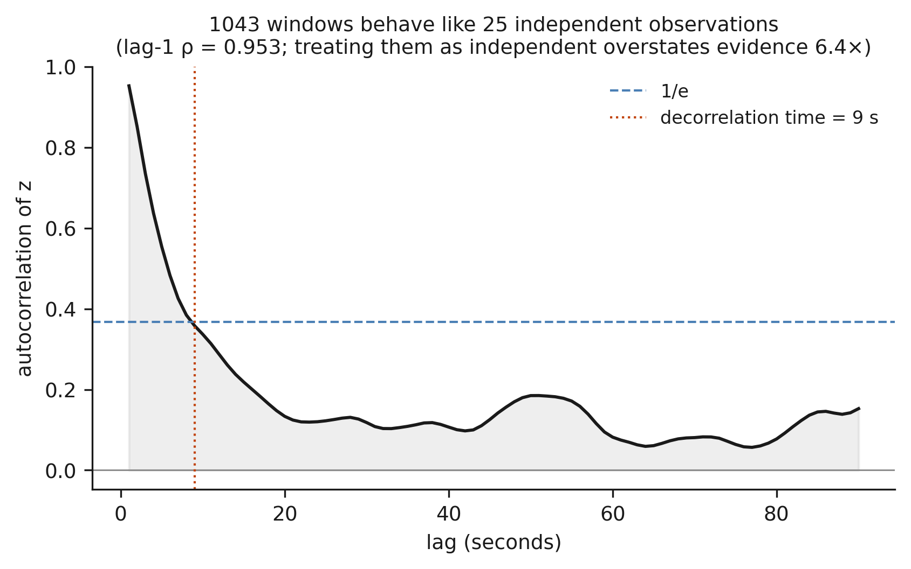
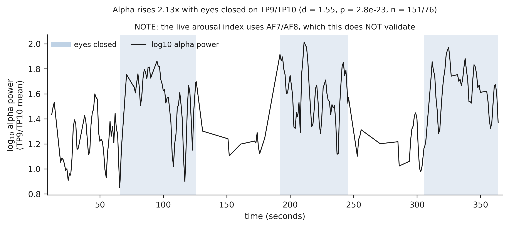
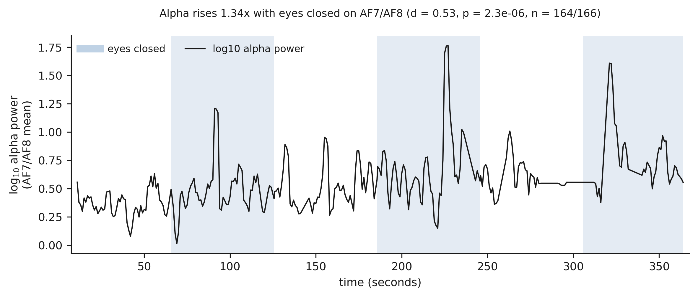

# Measuring and Decomposing End-to-End Latency in a Closed-Loop EEG-Driven Music System

Kirthan Kulkarni

> Readable copy of `arxiv_short.tex`, which is the version submitted. Keep the two in step.
> Every quantitative claim is regenerated by `python scripts/verify_claims.py`.

---

## Abstract

Closed-loop systems that adapt music to a listener's electroencephalogram (EEG) have been
demonstrated repeatedly, yet none of the systems we could examine reports a measured
end-to-end latency, even though neurofeedback studies find that feedback effects weaken or
disappear at delays of 0.5–1 s. We present a closed-loop EEG-driven music system built on
consumer hardware and characterise its latency component by component. The system
estimates arousal from a frontal log(β/α) index, maps it onto a nine-level prompt ladder
following the iso-principle, and plays audio from a library of pre-rendered MusicGen
segments. Generation runs 1.05–6.27× slower than realtime in every configuration tested,
which motivates the precomputed library; the library reduces worst-case audio latency from
8.0 s to 1.0 s. The deployed end-to-end latency is 6.5 s, of which 84.6% is attributable to
the analysis path rather than the generative model. Evaluated against labelled
eyes-open/eyes-closed ground truth, the deployed estimator is dominated by 8 of 9 alternative
configurations on both detection latency and information rate. The architecture admits an
analysis-path floor of 0.189 s and an end-to-end latency of 0.439 s, at which the
information rate is 1.83× that of the deployed configuration. We further report four
statistical properties of closed-loop EEG data that bear on study design, including a 6.4×
inflation of apparent evidence due to autocorrelation. All 46 quantitative claims are
regenerated from recorded data by a single script. No claim of therapeutic efficacy is made.

**Keywords:** closed-loop systems · EEG · latency · neurofeedback · music generation ·
reproducibility

---

## 1. Introduction

Music listening is a low-cost, non-invasive means of influencing affective state, and a
growing body of work seeks to make it adaptive by closing the loop through the listener's
brain activity. In such systems, EEG is recorded continuously, an affective or arousal state
is estimated, and the music is adjusted in response. Several systems of this kind have been
built and described [1–3, 5, 6], and the area has been surveyed [4].

These systems are typically described as real-time, but the time they take to respond is
rarely measured. This omission is consequential. In neurofeedback, delay is itself an
experimental variable: Belinskaia et al. [7] trained parietal alpha with feedback delayed by
0, 250 and 500 ms and found that sustained post-training change was negatively correlated
with latency and absent at 500 ms, and Asai et al. [8] observed an effect on EEG microstates
only at zero delay, with a one-second delay sufficient to abolish it. A closed-loop music
system whose response time is unknown cannot be placed relative to these findings.

In this work, we build a closed-loop EEG-driven music system on consumer hardware and
measure where its latency arises. The system comprises a four-channel Muse headband, a
frontal arousal index normalised to each listener's baseline, a controller that applies the
iso-principle over a nine-level prompt ladder, and an audio engine that selects from a
library of pre-rendered segments rather than generating music online. We decompose the
end-to-end delay into its analysis and audio components, evaluate alternative estimator
configurations against labelled ground truth, and identify the lowest latency the
architecture can reach.

Our contributions are summarised as follows:

- We report a measured, component-wise latency budget for a closed-loop EEG-driven music
  system, and show that the dominant term (84.6% of 6.5 s) lies in the analysis path rather
  than in music generation.
- We show that the deployed estimator is dominated by 8 of 9 alternatives on both detection
  latency and information rate, and that the architecture's latency floor (0.439 s
  end-to-end) is also its most informative operating point.
- We demonstrate that, for a controller with a finite prompt space, a precomputed audio
  library is preferable to online generation independently of generator speed, and reduces
  worst-case audio latency eightfold.
- We identify four statistical properties of closed-loop EEG data that affect the design and
  analysis of studies using such systems, and calibrate one of them against synthetic ground
  truth.

---

## 2. Related Work

### 2.1 Closed-Loop EEG-Driven Music Systems

Recent systems differ widely in how they decode affect and produce music. MindMelody decodes
valence and arousal with a Transformer-GNN encoder, plans interventions with a
retrieval-augmented language model, and conditions MusicGen-medium on the result [1]; it
reports 76.8% valence and 72.4% arousal accuracy cross-subject on DEAP. Ran et al. generate
emotional music in real time from EEG [2]. Ehrlich et al. close the loop with synthesised
affective music [3]. Velasquez-Peña et al. drive Ableton Live from a consumer Muse S
headband [5], and Monroy-D'Croz et al. build a minimalist interface on prefrontal EEG over
Lab Streaming Layer [6]. All of these decode affect with more sophistication than the single
hand-built index used here, and we make no claim of superior decoding capability.

None of these systems reports a measured, decomposed signal-to-audio latency. MindMelody
gives no latency, inference time or hardware specification, and Monroy-D'Croz et al. report
no latency and no control condition. Ehrlich et al. are a partial exception: they report a
4 s analysis window at 87.5% overlap (a 0.5 s update rate), select zero-phase filtering to
avoid delay, and tune a feedback parameter against perceived latency, but do not convert
these into an end-to-end figure.

### 2.2 Feedback Latency

Delay is treated as a primary variable in neurofeedback [7, 8] and as a design requirement in
interactive music generation; Gesture2Music, for example, reports 30 ms inference against a
stated 100 ms interaction threshold [9]. The present work applies the same standard of
measurement to EEG-driven music.

### 2.3 The Iso-Principle

The iso-principle holds that music should first match a listener's present state and then
lead it gradually toward a target [10]. Its supporting evidence comes largely from fixed,
non-adaptive sequences: Starcke et al. randomised 107 participants to four pre-set sequences
after a sadness induction and found that the iso sequence produced higher positive affect
and valence (η² = 0.08 and 0.09) under passive listening [11]. We return to the implications
of this in Section 8.

---

## 3. System Design

### 3.1 Overview

The system forms a loop of four stages: acquisition, arousal estimation, prompt selection
and audio rendering. A Muse 2 headband streams four EEG channels at 256 Hz over Lab Streaming
Layer. An arousal index is computed over sliding windows, normalised to the listener's
baseline, and mapped by the controller to one of nine text prompts. The audio engine plays
segments associated with the current prompt and crossfades to a new segment when the prompt
changes.

### 3.2 Arousal Estimation

The frontal channels AF7 and AF8 are averaged. Each window of length W is detrended,
band-pass filtered between 1 and 45 Hz, notch filtered at 60 Hz, and transformed with
Welch's method [12] to obtain band powers P_α and P_β. The raw index

  I_t = log( P_β(t) / P_α(t) )                                              (1)

is computed every hop H and smoothed with a one-pole filter of time constant τ:

  s_t = (1 − a) s_{t−1} + a I_t,   a = 1 − exp(−H/τ)                         (2)

The smoothed index is standardised against a 120 s eyes-open baseline with mean μ_b and
standard deviation σ_b:

  z_t = (s_t − μ_b) / σ_b                                                    (3)

Windows exceeding a 350 µV peak-to-peak amplitude are rejected and do not update the
smoother. The deployed configuration uses W = 4 s, H = 1 s and τ = 3 s.

### 3.3 Prompt Controller

The controller quantises z_t onto a ladder of nine rungs, each spanning 0.5 standard
deviations and centred on rung c = 4:

  k_t = clip( c + round(z_t / w), 0, 8 ),   w = 0.5                          (4)

Following the iso-principle, the controller does not move directly to the target rung k*,
obtained by applying the same mapping to the target z*, but plays the rung adjacent to the
listener's current rung in the direction of the target:

  k̂_t = k*                      if |z_t − z*| ≤ δ
  k̂_t = k_t + sgn(k* − k_t)     otherwise                                    (5)

where δ = 0.35 is a deadband within which the listener is considered to be at the target.
For relaxation, z* = −1. Each rung corresponds to one text prompt, so the controller's output
space consists of exactly nine strings. A minimum dwell time D prevents a new prompt change
until D seconds have elapsed since the previous one.

### 3.4 Audio Engine

Each of the nine prompts has 32 pre-rendered 8 s segments, generated offline with MusicGen
[13], for a total of 288 segments (38.4 minutes). When the prompt changes, the current
segment is abandoned and the engine performs an equal-power crossfade of duration T_xf into
a segment from the new rung.

This design follows from two properties. First, because the controller emits only nine
distinct prompts, a library covers its entire output space exactly; re-synthesising one of
nine prompts online would be redundant even with an arbitrarily fast generator. Second, a
streaming generator must play each queued segment to completion, so its audio latency is
bounded by the queue rather than by generation speed:

  L_audio(stream) ≤ Q · S,   L_audio(library) ≤ T_xf                         (6)

where Q is the queue depth and S the segment duration. In our configuration this reduces
the worst-case audio latency from 8.0 s to 1.0 s.

---

## 4. Latency Characterisation

### 4.1 Experimental Setup

**Generation benchmark.** We measured MusicGen throughput in nine benchmark runs spanning two
GPU tiers (a laptop GPU and a datacenter NVIDIA T4), two inference backends (Hugging Face
Transformers and Audiocraft) and three precision modes (fp32, fp16 with autocast, and fp16
with half-precision weights), giving 44 configuration cells.

**Ground truth for the analysis path.** Estimator configurations were evaluated offline on a
recording with alternating labelled eyes-open and eyes-closed blocks, which produce a known
change in alpha power at known times. Each configuration was applied to the raw recording,
and its reproduction of the deployed pipeline was verified against the session log
(r = 0.989; configurations reproducing it below r = 0.9 are rejected).

### 4.2 Metrics

The analysis-path latency of a windowed estimator is the sum of the window centroid delay,
the mean hop quantisation delay and the smoother's group delay:

  L_analysis = W/2 + H/2 + τ,   L_total = L_analysis + L_audio               (7)

*Detection latency* is the median time from a labelled state transition to the estimator
crossing the midpoint between the two state means. Discriminability d is the standardised
difference in the estimator's output between eyes-closed and eyes-open blocks. Because
consecutive outputs are autocorrelated, we also compute the number of independent
observations per minute,

  n_ind = (60 / H) · (1 − ρ) / (1 + ρ)                                       (8)

where ρ is the lag-1 autocorrelation of the output. We score each configuration by its
information rate

  R = d · √n_ind                                                             (9)

the t-statistic per square-root minute, which governs how precisely a session of fixed
duration resolves a difference in state. Latency alone would favour no smoothing, and
discriminability alone would favour smoothing everything to a constant; R balances the two.

### 4.3 Generation Throughput

Every one of the 44 configuration cells ran between 1.05× and 6.27× slower than realtime,
with the best case on the datacenter T4. The bottleneck is the sequential autoregressive
decode loop rather than arithmetic throughput: on the T4, fp32 outperformed fp16 with
half-precision weights by a factor of 0.952, and the ordering fp32 < fp16-half < fp16 held in
6 of 6 cells. Autocast inserts a type conversion at every operation, a cost that is
amortised in large batched training workloads but not in batch-1 decoding. Between-run
variation for an identical configuration reached 1.96× on the thermally limited laptop and
1.18× on the T4, so single-run measurements on consumer GPUs should be reported as ranges.

### 4.4 End-to-End Latency Budget

Table 1 decomposes the deployed latency. The analysis path contributes 5.5 s, comprising
2.0 s of window centroid delay, 0.5 s of hop quantisation and 3.0 s of smoother group delay.
The measured detection latency against labelled ground truth is 5.67 s, consistent with the
prediction. With a 1.0 s crossfade, the worst-case end-to-end latency is 6.5 s, of which
84.6% is analysis.

**Table 1.** Deployed end-to-end latency budget.

| component | latency (s) |
|---|---|
| window centroid (W/2, W = 4 s) | 2.0 |
| hop quantisation (H/2, H = 1 s) | 0.5 |
| smoother group delay (τ = 3 s) | 3.0 |
| **analysis path** | **5.5** |
| audio crossfade (T_xf) | 1.0 |
| **end-to-end** | **6.5** |

### 4.5 Estimator Comparison

Table 2 compares the deployed estimator with two representative alternatives, and Figure 1
shows all ten configurations. Eight of the nine alternatives are both faster and more
informative than the deployed setting, which therefore does not represent a
latency–accuracy trade-off but lies off the efficient frontier.

**Table 2.** Representative estimator configurations evaluated against labelled eyes-open and
eyes-closed blocks.

| configuration | detection (s) | d | n_ind/min | R |
|---|---|---|---|---|
| deployed (W = 4 s, H = 1 s, τ = 3 s) | 5.67 | 1.99 | 1.2 | 2.14 |
| windowed (W = 2 s, H = 0.5 s, τ = 0.5 s) | 1.68 | 1.14 | 13.6 | 4.20 |
| streaming (order 4, τ = 0.25 s) | 0.17 | 0.70 | 30.9 | 3.91 |

**Figure 1.** Detection latency against information rate R for each estimator configuration.
The shaded region contains configurations that improve on the deployed setting on both
axes; 8 of the 9 alternatives fall inside it.

The principal cause is the smoother. At τ = 3 s, consecutive outputs are nearly identical
(ρ = 0.962), yielding only 1.2 independent observations per minute. The smoother is
therefore simultaneously the largest latency term and the main source of the autocorrelation
discussed in Section 5; reducing τ improves both.

### 4.6 Latency Floor

A causal streaming estimator has no window centroid or hop quantisation, so its only delays
are filter group delay and smoothing. A second-order design with τ = 0.1 s reaches an
analysis-path latency of 0.189 s. Table 3 combines analysis-path and crossfade durations and
compares each total with the 500 ms delay at which Belinskaia et al. [7] no longer observed a
training effect.

**Table 3.** End-to-end latency by configuration, relative to the 500 ms delay of Belinskaia
et al.

| analysis path (s) | crossfade (s) | end-to-end (s) | ratio to 500 ms |
|---|---|---|---|
| deployed, 5.500 | 1.00 | 6.500 | 13.0 |
| retuned, 1.750 | 1.00 | 2.750 | 5.5 |
| floor, 0.189 | 1.00 | 1.189 | 2.4 |
| floor, 0.189 | 0.25 | 0.439 | 0.9 |

Two observations follow. First, the dominance of the analysis path is a property of the
configuration rather than of the architecture: at the floor, the crossfade becomes the
largest term. Second, the floor is not a compromise. Although per-window discriminability
falls from d = 1.99 to 0.61, the number of independent observations rises from 1.2 to 41.4
per minute, and the resulting information rate is 1.83× that of the deployed configuration.

Three caveats apply. Detection latency does not decrease monotonically with the budget:
below τ ≈ 0.25 s the estimate becomes noisy enough that threshold crossings are harder to
localise. The eyes-open/eyes-closed contrast is considerably larger than the contrast
expected between adaptive and non-adaptive music. Finally, no session has yet been run at
these settings, so the floor is characterised offline rather than in deployment.

### 4.7 Controller Stability at Low Latency

Adopting a faster estimator also requires changes to the controller. Replaying a recorded
session through the W = 2 s, H = 0.5 s, τ = 0.5 s configuration produces 591 prompt changes
that arrive before the preceding crossfade has completed, because a less smoothed index
crosses rung boundaries frequently. Imposing a minimum dwell D ≥ T_xf guarantees that no
change begins before the previous crossfade ends, and reduces this count to 0. The dwell
adds to worst-case latency, which becomes L_analysis + D + T_xf.

---

## 5. Statistical Properties of Closed-Loop EEG Data

### 5.1 Autocorrelation

A 20-minute session yields 1043 valid windows at a 1 s hop. With lag-1 autocorrelation
ρ = 0.953, the AR(1) effective sample size

  N_eff = N · (1 − ρ) / (1 + ρ)                                              (10)

is 25.3. A test that treats the windows as independent therefore overstates its evidence by
√(1043/25.3) = 6.4×, enough to turn p = 0.4 into p = 0.05. Figure 2 shows that the index
decorrelates over approximately 9 s, a time scale set largely by the smoother rather than by
the listener.

**Figure 2.** Autocorrelation of the arousal index as a function of lag in a 20-minute
session.

### 5.2 Continuous Audio-Neural Coupling

Cross-correlating the audio envelope with the neural index over a full session loses
statistical power precisely when the intervention succeeds. A listener who reaches the target
and remains there holds the controller on a single rung, leaving little controller-driven
variation in the audio to correlate. In our first pilot, the listener occupied one rung for
95.9% of the session and the coupling estimate was r = −0.054 (p = 0.795), although the same
estimator recovers a known 6 s lag exactly from synthetic data. The limitation therefore
lies in the outcome measure, not in the estimator.

### 5.3 Event-Locked Responses

Restricting analysis to moments when the rung changes restores power, but introduces a
confound: a rung change occurs because z has moved, and z continues to move afterward, so a
positive event-locked effect arises even when the music has no influence. We calibrated this
confound using synthetic sessions with known ground truth. The estimator returned +1.503 for
a simulated responder, −1.467 for an anti-responder and +0.011 (p = 0.573) for an unrelated
session. A fourth session, constructed with no audio effect but with rung changes triggered
by boundary crossings as in the real controller, returned +0.435 (p = 0.010). The pilot value
of +0.412 is indistinguishable from this pure confound. Its pre-onset slope (+0.1292 z/s,
against +0.0573 for the confound and +0.0012 for a genuine response) and its peak at onset
followed by decay are characteristic of the confound rather than of a response. A positive
within-condition event-locked effect is therefore not evidence of an effect; only the
contrast against a yoked sham condition is interpretable.

### 5.4 Dichotomised Outcomes

Time spent within a target band is clinically interpretable but discards information about
distance from the band and saturates for listeners far outside it. Simulated against the
measured autocorrelation, it requires an effect roughly three times larger to be detected
than the mean of z. We therefore designate mean z as the primary outcome. Under a crossover
design with 10 participants, power to detect a 0.15 standard deviation effect is 38.8%, and
25 participants per arm are required for 80% power.

---

## 6. Signal Validation

We assess two separate properties: whether the electrodes record cortical activity, and
whether the log(β/α) index tracks arousal.

**Cortical signal.** In an eyes-open/eyes-closed recording on the temporal pair TP9/TP10,
alpha power rose 2.13× on eye closure (d = 1.55, p = 2.8 × 10⁻²³). This recording used a
150 µV rejection threshold, which preferentially removes eyes-open windows because blinks
occur with the eyes open; at the deployed 350 µV threshold the two conditions are nearly
balanced and the ratio is 1.90×. The effect is significant at every threshold tested,
including no rejection.

**Index channels.** Because the arousal index uses AF7/AF8 rather than TP9/TP10, we repeated
the recording on those channels (Figure 3). Alpha power again rose significantly, by 1.34×
(d = 0.53, p = 2.3 × 10⁻⁶, 6.8% of windows rejected), or by 1.41× (d = 0.61) when the
protocol's 3 s settling period after each instruction is excluded. However, the eyes-closed
increase in spectral peak prominence, which the temporal channels pass clearly, was 1.09× on
AF7 and 1.13× on AF8, below a 1.2× criterion. Alpha power therefore rises on the frontal
channels, but a distinct alpha peak barely emerges. This is consistent with Monroy-D'Croz et
al., whose frontal alpha asymmetry explained 0.40% of signal variance [6].

**Figure 3.** Alpha power during alternating eyes-open and eyes-closed blocks (shaded). Top:
temporal channels TP9/TP10. Bottom: frontal channels AF7/AF8, from which the arousal index
is computed. The flat segment near 300 s in the lower panel is a stream dropout.

**Arousal.** We tested the index on the public DEAP dataset [14], which pairs 32-channel EEG
with self-reported affect, using the same feature extractor as the live system. On AF3/AF4
the index correlated with reported arousal at ρ = +0.303 (p = 0.058) and with valence at
+0.082. The direction of the arousal correlation was positive across 7 of 7 independent
montages (sign test p = 0.016).

---

## 7. Reproducibility

Every quantitative claim in this paper is regenerated from recorded data by a single script,
which compares each recomputed value with the value stated here and fails on any
disagreement; all 46 claims currently reproduce. This practice identified several defects
that would otherwise have reached the manuscript, three of which generalise to any
pre-registered study with an evolving codebase. First, recordings must be referenced by name
rather than selected as the most recent: a second pilot session silently replaced the data
underlying a dozen claims, five figures and eight tests. Second, synthetic data must be
structurally excluded from analysis: a brief demonstration run once recomputed six claims
from a signal generator. Third, a pre-registration integrity check must not force its own
violation: storing the deviation log inside the hashed file made recording a deviation fail
the check, and the log was moved outside it.

Two data-acquisition defects were also invisible to existing checks. The streaming layer
delivered each packet two to four times, with timestamps stepping backwards between copies,
which downstream code interpreted as electrode failure. Separately, raw timestamps were
stored at a precision that degraded with system uptime, from 8 ms after a fresh boot to
0.25 s after 27 days.

---

## 8. Limitations

**Efficacy.** This work makes no claim that the intervention benefits listeners. The evidence
consists of two self-administered, unblinded sessions; no adaptive/sham pairs have been
collected and no participants have been enrolled.

**Latency relative to the neurofeedback literature.** The deployed latency is 13× the delay
at which Belinskaia et al. no longer observed an effect, and the retuned configuration
remains 5.5× that delay. These findings concern operant neurofeedback, in which the listener
must perceive a contingency, whereas the mechanism proposed here is the iso-principle, whose
evidence comes from fixed sequences without any contingency [11]. This argument has a
consequence: if a fixed iso sequence is effective, an adaptive system must outperform a fixed
playlist rather than silence, which is the comparison a yoked sham condition provides.

**Controller degeneracy.** A controller can operate correctly yet produce no manipulation. In
our second pilot, a ladder of 1.0 standard deviation per rung mapped the listener to a single
rung for the entire 20-minute session, so a yoked sham would have been acoustically identical
to the adaptive condition. Narrowing the rungs to 0.5 standard deviations restored variation
(33 prompt changes across 5 prompts in one recording when replayed through the revised
controller). We recommend that studies of adaptive audio report the number of prompt changes
and distinct prompts per session.

**Signal quality and scope.** The frontal channels used by the index produce a weaker alpha
response than the temporal channels and fail the peak-prominence criterion. All latency
results are measured on an eyes-open/eyes-closed contrast with a single headset, operator and
participant.

---

## 9. Conclusion

We presented a closed-loop EEG-driven music system and a measured decomposition of its
end-to-end latency. Contrary to the common emphasis on faster generative models, the dominant
source of delay was the analysis path, and that dominance proved to be a property of the
configuration rather than the architecture. The deployed estimator was dominated by 8 of 9
alternatives on both latency and information rate, and the architecture's floor of 0.439 s
end-to-end was also its most informative configuration. We additionally described four
statistical properties of closed-loop EEG data that should inform the design of studies using
such systems. These results characterise the system's engineering behaviour; establishing
whether adaptive music confers any benefit over a fixed playlist requires a controlled study
with participants, which remains future work.

---

## Code and Data Availability

All code, the pre-registered analysis plan, the deviation log and the session artefacts
underlying this paper are available at
<https://github.com/kirthankulkarni-bit/Brain-Music-Therapy>. The 46 claims are regenerated
and checked by `python scripts/verify_claims.py`, and the figures by
`scripts/make_figures.py`. The audio library is omitted for size; its manifest is included
and `scripts/build_library.py` regenerates it.

## Acknowledgements

The author used Claude (Anthropic), an AI assistant, for help with software development,
data analysis and drafting this manuscript. The author designed the study, conducted all
recording sessions and takes full responsibility for the content. All quantitative results
were regenerated from recorded data by the verification script described above.

---

## References

1. Y. Zhang, Y. Sun, H. Gu, and Z. Jin, "MindMelody: A closed-loop EEG-driven system for
   personalized music intervention," arXiv:2605.01235, 2026.
2. Ran et al., "Mind to Music: An EEG signal-driven real-time emotional music generation
   system," *International Journal of Intelligent Systems*, art. 9618884, 2024.
   doi:10.1155/int/9618884.
3. S. K. Ehrlich, K. R. Agres, C. Guan, and G. Cheng, "A closed-loop, music-based
   brain-computer interface for emotion mediation," *PLOS ONE*, 2019.
   doi:10.1371/journal.pone.0213516.
4. A. Dash and K. R. Agres, "AI-based affective music generation systems: A review of methods
   and challenges," arXiv:2301.06890, 2023.
5. Velasquez-Peña et al., "Neurophone: A brain-computer music interface for emotional
   neurofeedback," in *Proc. IEEE Int. Symposium on the Internet of Sounds*, 2025.
6. P. A. Monroy-D'Croz, R. Ramirez-Melendez, and J. Cespedes-Guevara, "A minimalist
   brain-computer musical interface for real-time emotion-driven sonification,"
   arXiv:2606.01473, 2026.
7. A. Belinskaia, N. Smetanin, M. Lebedev, and A. Ossadtchi, "Short-delay neurofeedback
   facilitates training of the parietal alpha rhythm," *Journal of Neural Engineering*, 2020.
   doi:10.1088/1741-2552/abc8d7.
8. T. Asai, T. Hamamoto, S. Kashihara, and H. Imamizu, "Real-time detection and feedback of
   canonical electroencephalogram microstates," *Frontiers in Systems Neuroscience*, 2022.
   doi:10.3389/fnsys.2022.786200.
9. R. Jeyaraj, B. Subramanian, K. Gangadharan, and A. Paul, "Gesture2Music: A low-latency
   real-time framework for continuous gesture-driven music generation," arXiv:2511.00793.
10. I. M. Altshuler, "The past, present and future of psychiatric music therapy," *American
    Journal of Psychiatry*, 1948.
11. K. Starcke, J. Mayr, and R. von Georgi, "Emotion modulation through music after sadness
    induction: The iso principle in a controlled experimental study," *International Journal
    of Environmental Research and Public Health*, 2021. PMC8656869.
12. P. D. Welch, "The use of fast Fourier transform for the estimation of power spectra: A
    method based on time averaging over short, modified periodograms," *IEEE Transactions on
    Audio and Electroacoustics*, vol. 15, no. 2, pp. 70–73, 1967.
13. J. Copet, F. Kreuk, I. Gat, T. Remez, D. Kant, G. Synnaeve, Y. Adi, and A. Défossez,
    "Simple and controllable music generation," in *Advances in Neural Information
    Processing Systems*, vol. 36, 2023.
14. S. Koelstra et al., "DEAP: A database for emotion analysis using physiological signals,"
    *IEEE Transactions on Affective Computing*, vol. 3, no. 1, pp. 18–31, 2012.
